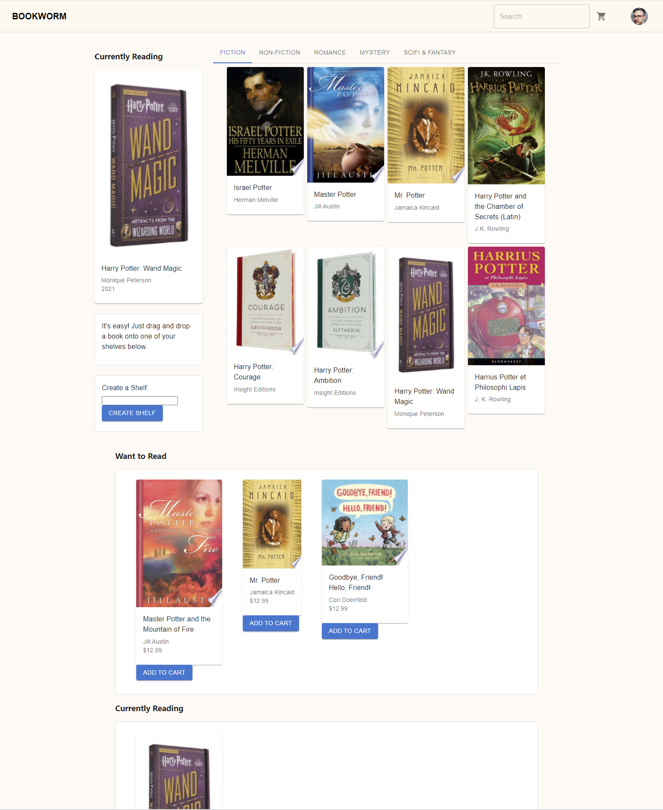

## Bookworm Capstone

[You can see the live app here.](https://bookworm-capstone.onrender.com)

Bookworm is a single page application created with Ruby on Rails and React. It is intended to be used by readers to track which books they are reading, they'd like to read in the future, or have already read. The simple drag and drop interface makes changing categories effortless. Books are found using the Google Books API and saved on the backend with PostgreSQL. There is also a checlout feature where a user can buy books from their lists. 
### Features

A user can: 
- Sign up for an account
- Find new books to add to their shelves from the Google Books API
- Drag and drop books between shelves to reflect whether the book is being read, has already been read, or will be read in the future
- Search for new books from the Google Books API
- Add books to a shopping cart and checkout using Stripe
---
### Installation

Clone the repo to your local computer and make sure your system is running:

- Ruby 3.0.0
- NodeJS (v14 or higher)
- npm
- PostgreSQL

In the project directory, run the following steps to get started: 

Install the Ruby gem files and packages necessary to run the project with

`bundle install`

Then migrate the tables and associations. 

`rails db:migrate`

Once you have your backend setup, start your rails server

`rails s`

To run the front end, use 

`npm start --prefix client`

---

### Technologies

1. Ruby on Rails for the backend
2. React for the frontend
3. Recoil for state management
4. Material UI for the design
5. BCrypt for authentication and authorization
6. PostgreSQL for the database
7. Stripe integration for checkout

---

### Moving Forward
I'd love to flesh out this project by making the information provided even more robust. I'd like the user-created shelves to be able to be shared between users. Reviews could also be visible by other users. Ideally there would be book recommendations based on previous reading habits. 

---
### Creator

Megan Moulos
meganmoulos@gmail.com
[Github](https://github.com/meganmoulos) 